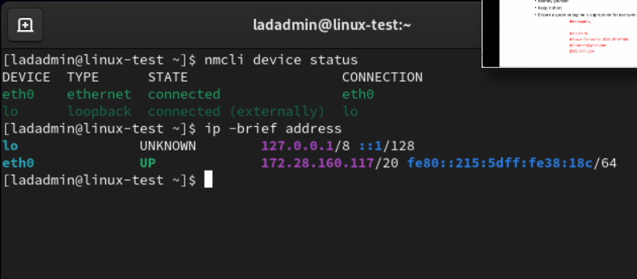
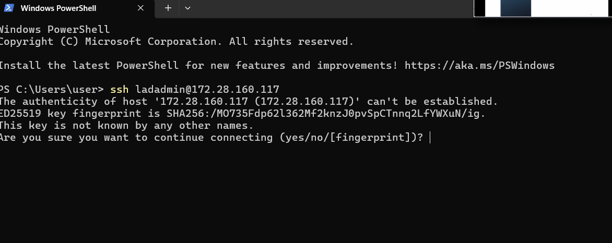
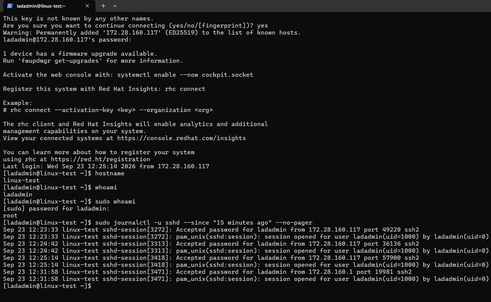
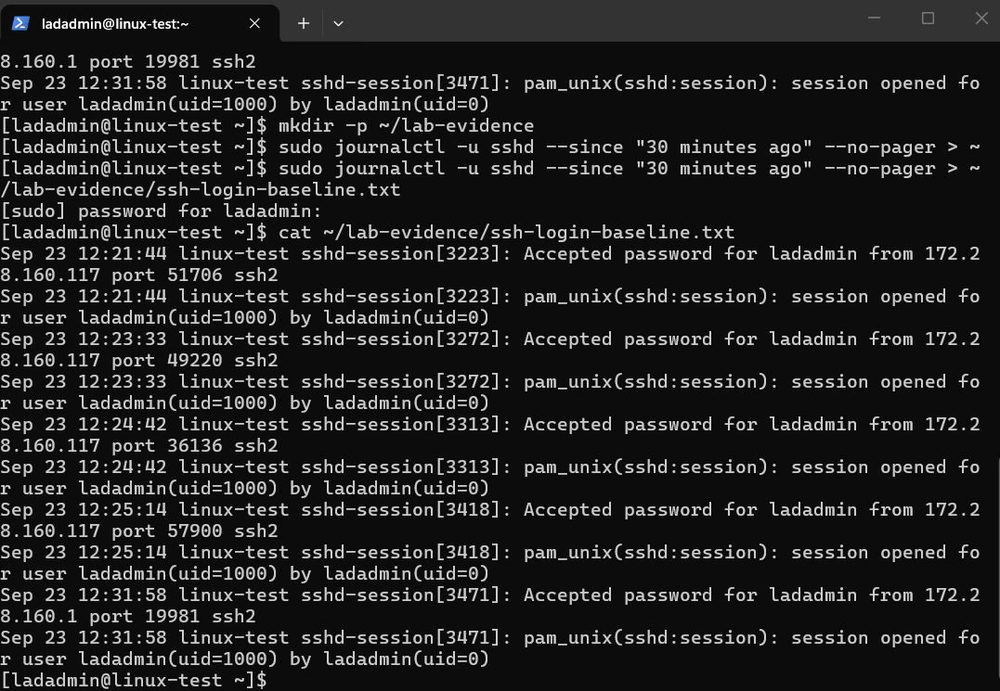
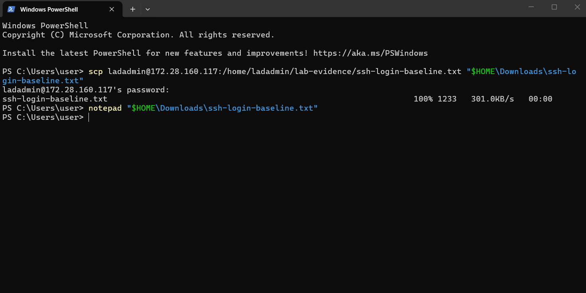
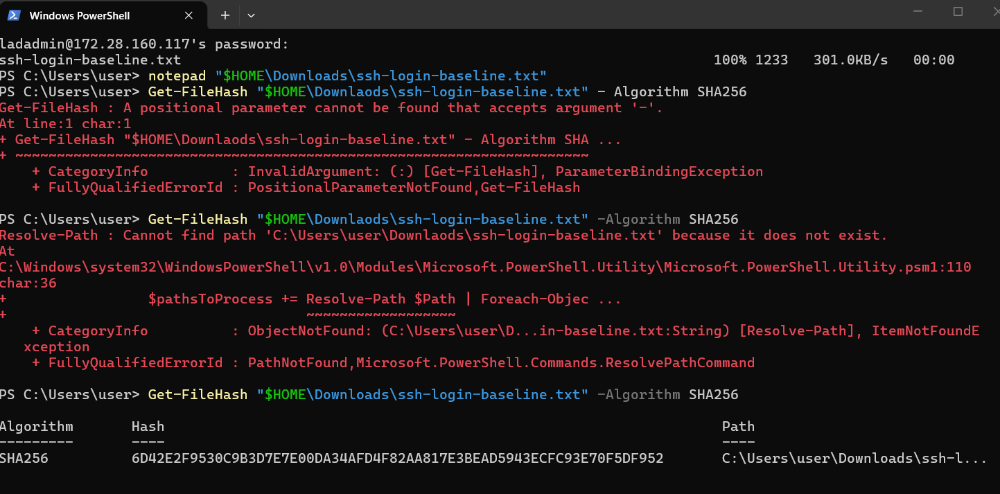
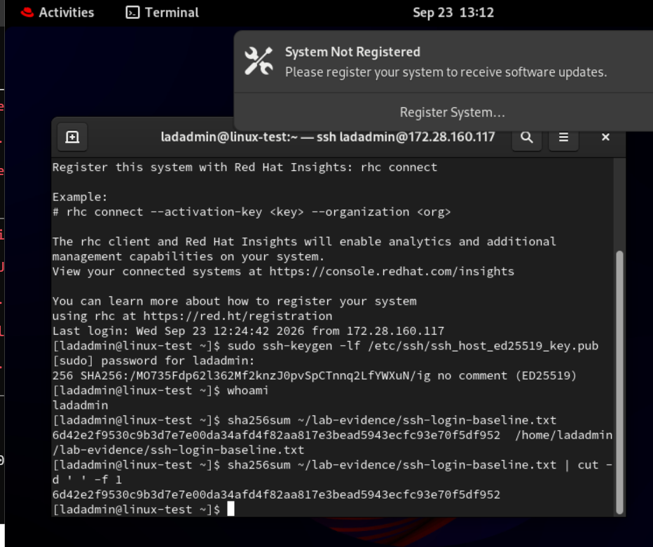

# Linux Remote Administration and Log Integrity Lab

Hands-on home lab • September 23, 2026

## Project summary

I configured a RHEL virtual machine for persistent network connectivity, accessed it from a Windows host over SSH, verified administrative access, reviewed authentication logs, and transferred a saved log to Windows. I then compared SHA-256 hashes to verify that the transferred file matched the Linux original.

This project demonstrates foundational Linux administration, troubleshooting, log review, and evidence handling in a personal Hyper-V lab. It is not a production deployment or a government system.

## Environment

| Component | Lab configuration |
|---|---|
| Host | Windows 11 with Hyper-V; 32 GB physical RAM and 1 TB storage capacity |
| Guest | Red Hat Enterprise Linux 9.8, x86_64 |
| Hostname | `linux-test` |
| Linux account | `ladadmin` |
| Network | Hyper-V Default Switch |
| VM address during testing | `172.28.160.117` |
| Windows-side address observed in SSH logs | `172.28.160.1` |
| Security state observed | SELinux enforcing; firewalld and sshd active |

The addresses are private lab addresses. The VM address was assigned dynamically and may change. Commands below document this particular lab rather than a universal network configuration.

## 1. Establish network connectivity and correct startup behavior

**Problem:** The `eth0` network interface was disconnected. Inspection of its saved NetworkManager profile showed `AUTOCONNECT` set to `no`.

In the Linux terminal, I activated the interface and inspected the configuration:

```bash
sudo nmcli device connect eth0
nmcli -f NAME,UUID,TYPE,DEVICE,AUTOCONNECT connection show
ip -brief address
```

I enabled automatic connection for the profile named `eth0` and verified the saved setting:

```bash
sudo nmcli connection modify eth0 connection.autoconnect yes
nmcli -f NAME,DEVICE,AUTOCONNECT connection show
sudo firewall-cmd --get-active-zones
```

The profile reported `AUTOCONNECT yes`, and the public firewall zone listed `eth0`. The follow-up network check showed the interface connected with address `172.28.160.117/20`:

```bash
nmcli device status
ip -brief address
```



**Evidence:** The screenshot confirms the connected state and assigned address. It does not independently establish that a reboot occurred between checks.

## 2. Connect from Windows to Linux using SSH

In **Windows PowerShell**, I initiated the connection:

```powershell
ssh ladadmin@172.28.160.117
```

For the initial host-key check, I inspected the server's ED25519 public-key fingerprint in the **Linux console**:

```bash
sudo ssh-keygen -lf /etc/ssh/ssh_host_ed25519_key.pub
```

I compared the fingerprint with the one presented by Windows, accepted the matching host key, and authenticated with my Linux account password.



**Troubleshooting lesson:** My first attempts ran inside the Linux VM and connected it to itself. I corrected this by launching SSH from a Windows prompt beginning with `PS C:\Users\...>`. The later session and source-address logs distinguish the actual Windows-to-Linux connection.

## 3. Verify identity and administrative access

Inside the SSH session, I ran:

```bash
hostname
whoami
sudo whoami
```

| Command | Observed result | What it establishes |
|---|---|---|
| `hostname` | `linux-test` | The hostname of the server executing the command |
| `whoami` | `ladadmin` | The current account |
| `sudo whoami` | `root` | This account could execute that command with administrative privileges |

Using `sudo` for a command did not permanently change the logged-in account to root.

## 4. Review SSH authentication logs

I inspected recent SSH service events:

```bash
sudo journalctl -u sshd --since "15 minutes ago" --no-pager
```



The log showed successful password authentication for `ladadmin`:

| Observed time on September 23 | Source address | Interpretation in this lab |
|---|---|---|
| 12:23–12:25 | `172.28.160.117` | Earlier connections from the VM to itself |
| 12:31:58 | `172.28.160.1` | Windows-host connection through the Hyper-V network |

The successful Windows login recorded source port `19981`. This was the client's temporary source port, not the SSH server's listening port of 22. The following session-open event confirmed the session started. The privileged process shown in the session-opening message does not mean the user authenticated as root.

## 5. Save the SSH logs as an evidence file

In Linux, I created an evidence directory, saved recent SSH logs, and read the saved file:

```bash
mkdir -p ~/lab-evidence
sudo journalctl -u sshd --since "30 minutes ago" --no-pager > ~/lab-evidence/ssh-login-baseline.txt
cat ~/lab-evidence/ssh-login-baseline.txt
```



The file was stored at `/home/ladadmin/lab-evidence/ssh-login-baseline.txt`. The `>` operator redirects output to a file and replaces existing contents at that path. The relative time filter captures the 30 minutes preceding execution; repeating it later would produce a different collection window.

## 6. Transfer the evidence to Windows

In a separate **Windows PowerShell** tab, I copied the file through SSH:

```powershell
scp ladadmin@172.28.160.117:/home/ladadmin/lab-evidence/ssh-login-baseline.txt "$HOME\Downloads\ssh-login-baseline.txt"
notepad "$HOME\Downloads\ssh-login-baseline.txt"
```



The transfer reported **100%** and **1,233 bytes**. The screenshot also records the Notepad launch command; it does not show the Notepad contents.

## 7. Verify the transferred file with SHA-256

On **Windows**, I calculated the copied file's hash:

```powershell
Get-FileHash "$HOME\Downloads\ssh-login-baseline.txt" -Algorithm SHA256
```

On **Linux**, I calculated the original file's hash:

```bash
sha256sum ~/lab-evidence/ssh-login-baseline.txt
```

To display only the hash for easier comparison, I also ran:

```bash
sha256sum ~/lab-evidence/ssh-login-baseline.txt | cut -d ' ' -f 1
```





**Result:** The full SHA-256 values in the two screenshots match when letter case is ignored. This provides strong evidence that the copied file's bytes matched the original at verification time. A matching hash alone does not prove the underlying log is authentic or establish a formal forensic chain of custody.

**Troubleshooting lesson:** I corrected a space in `-Algorithm` and a missing hyphen in the filename before the Windows command succeeded. Earlier errors are retained in the screenshot to document the troubleshooting process. The successful final outputs are the evidence used for the comparison.

## Skills demonstrated

- Inspected and corrected a NetworkManager connection profile.
- Distinguished the Windows host from the Linux guest when running commands.
- Compared an SSH host-key fingerprint before trusting the server from Windows.
- Verified remote identity and administrative command execution.
- Interpreted SSH authentication events, source addresses, and source ports.
- Saved journal output to a file and transferred it with SCP.
- Compared SHA-256 hashes across Windows and Linux.
- Diagnosed command syntax and file-path errors from their messages.

## Scope and remaining work

Red Hat registration remains unresolved: the web console showed an active Developer subscription, but the registration service did not list an accessible organization. An account access or provisioning mismatch was suspected, not confirmed. Subscription-backed updates and patch remediation have not yet been demonstrated.

This milestone does not claim Nessus/ACAS scanning, STIG compliance, an RMF authorization, or production operations experience. Linux file permissions are the next planned lesson.

## Evidence notes

The seven images in `evidence/` are original screenshots from the lab, copied without editing. Some contain incidental desktop content, login banners, and earlier command errors. They show a lab username and private IP addresses, not a public production target. The raw log file remains on the lab VM and Windows host; it is not included in this repository package.

