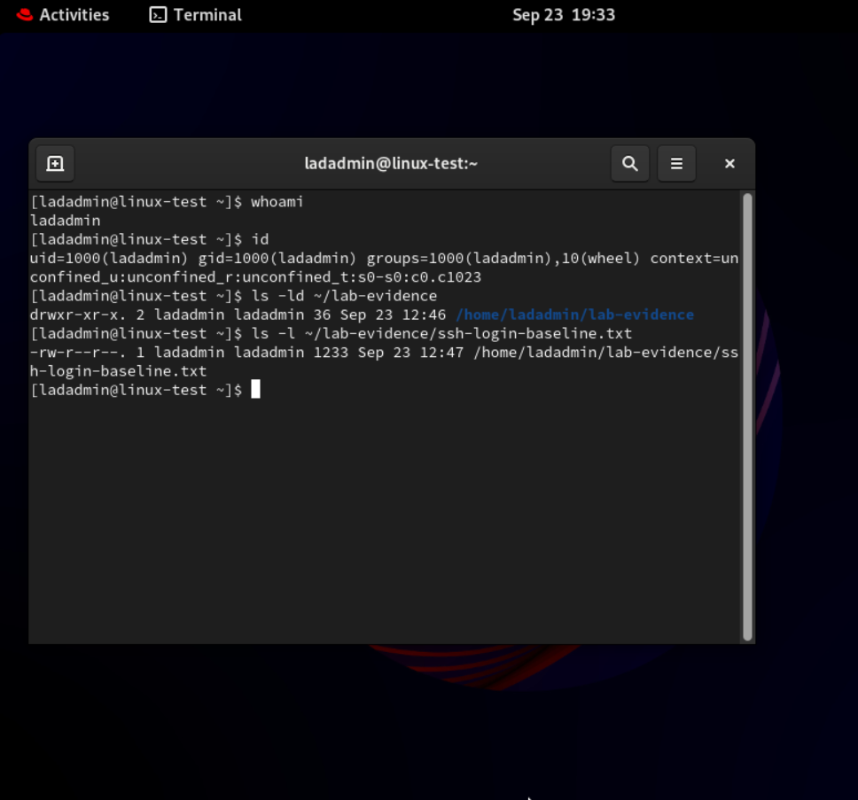
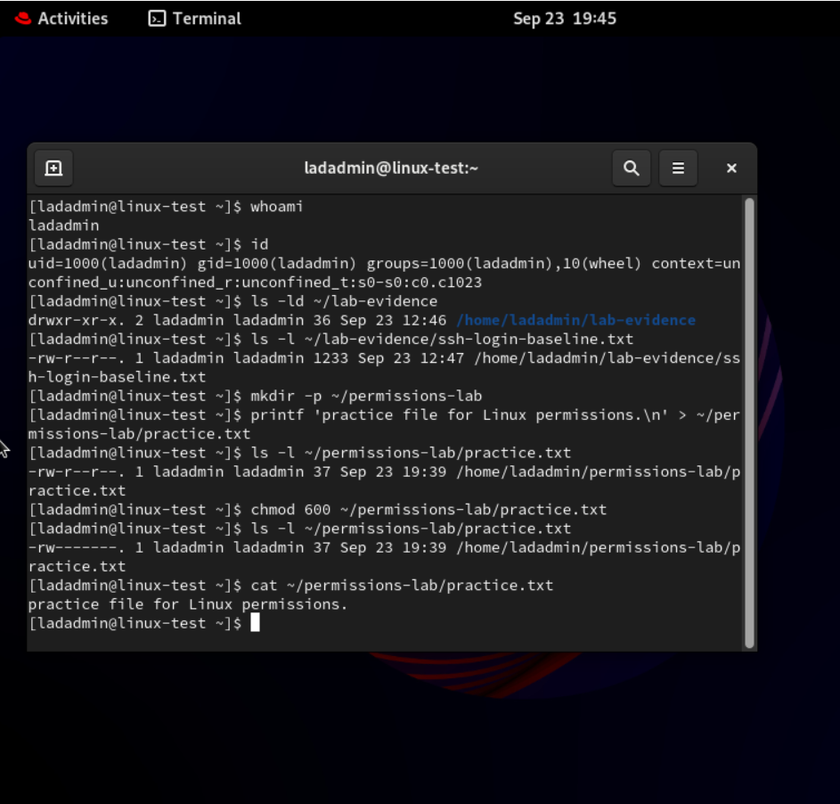
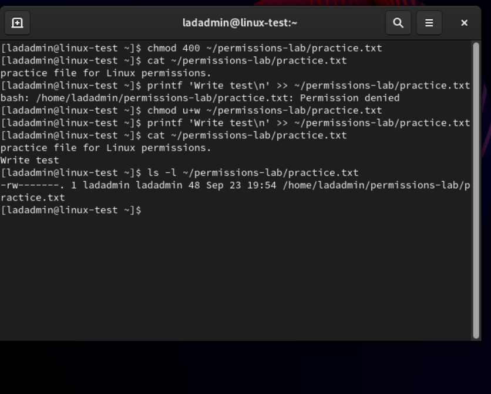
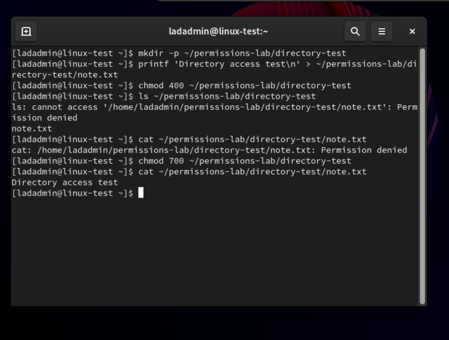
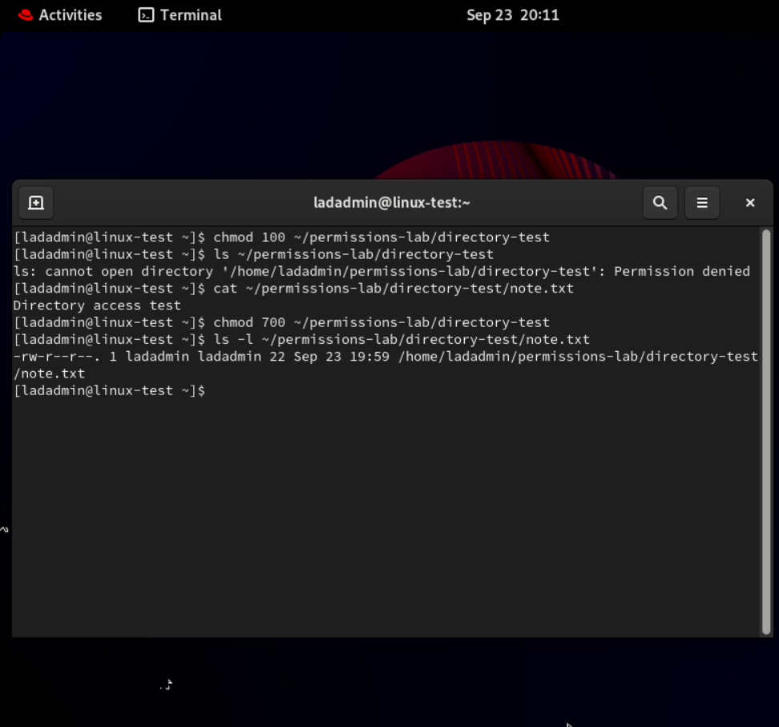
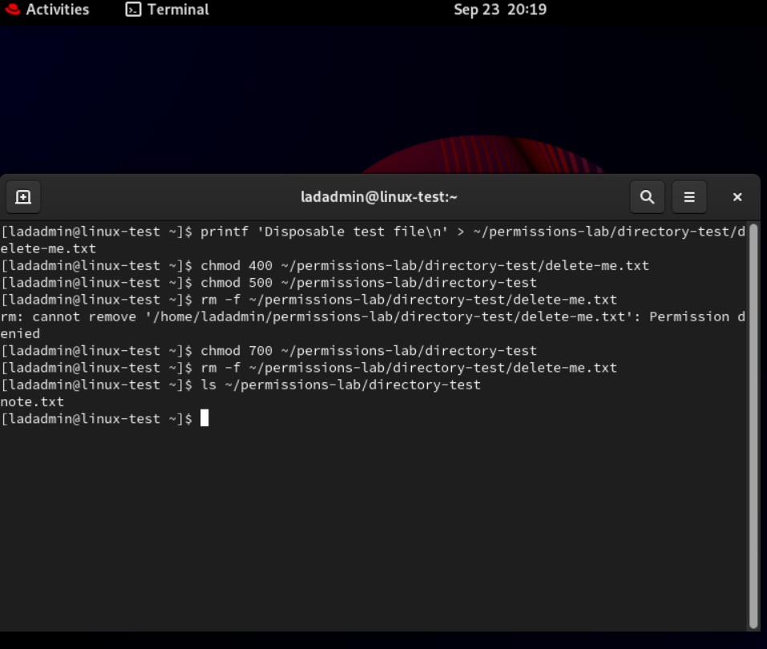
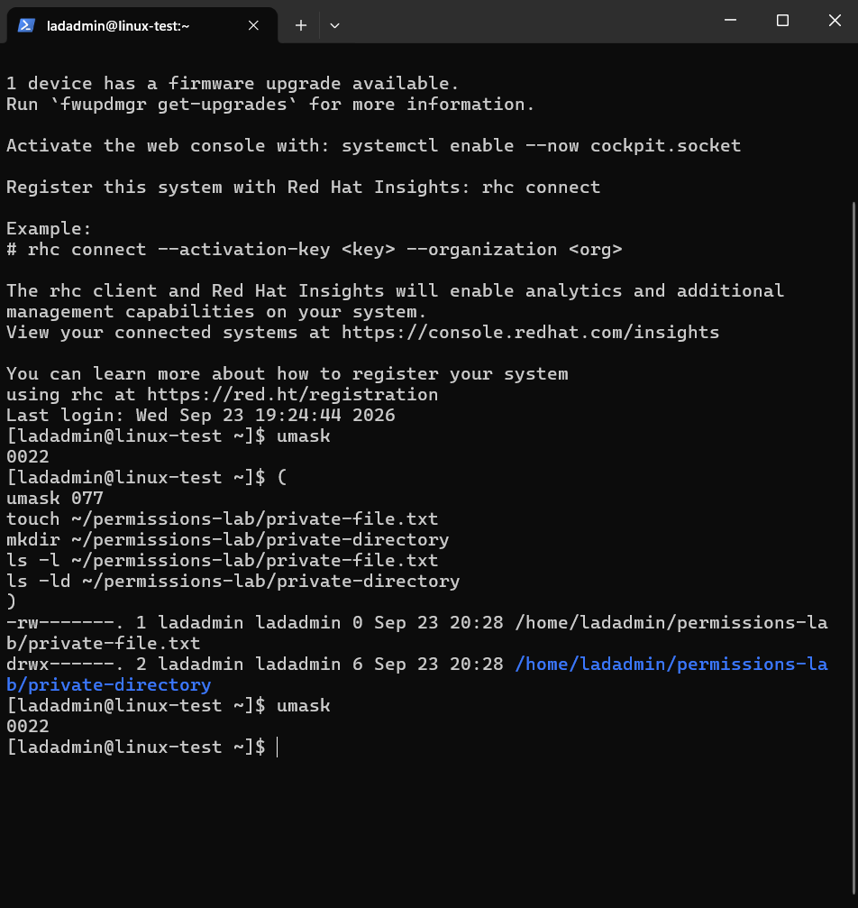
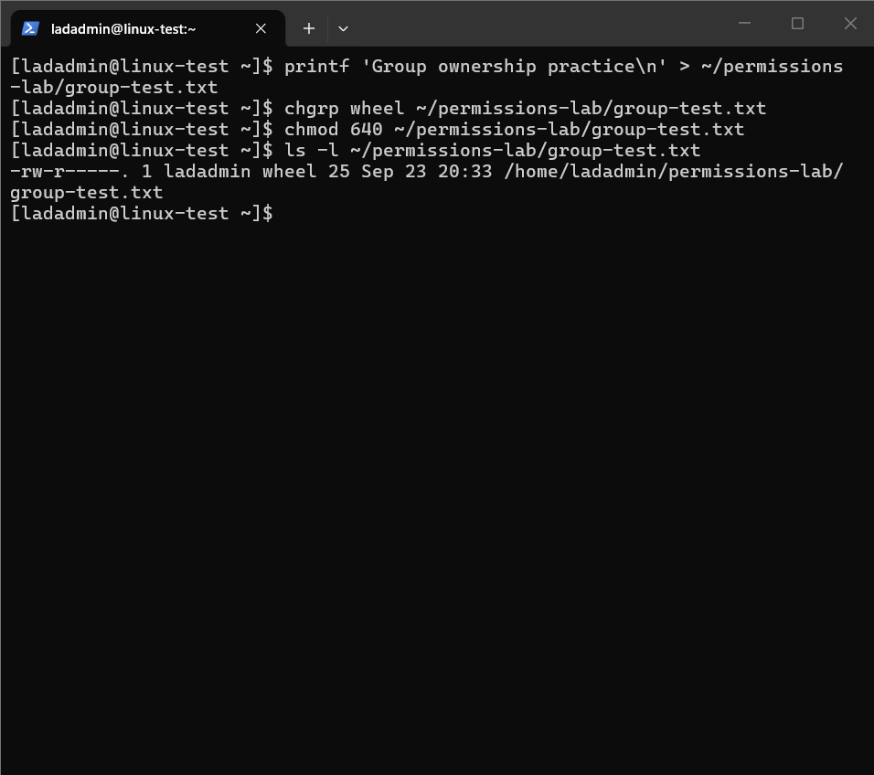
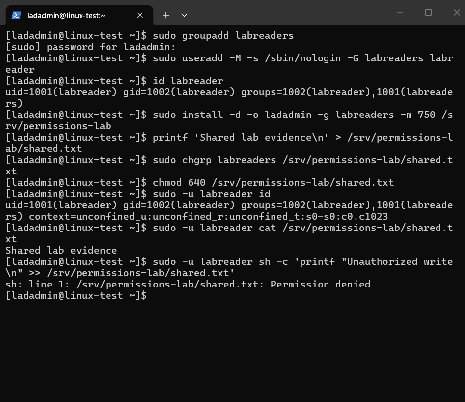
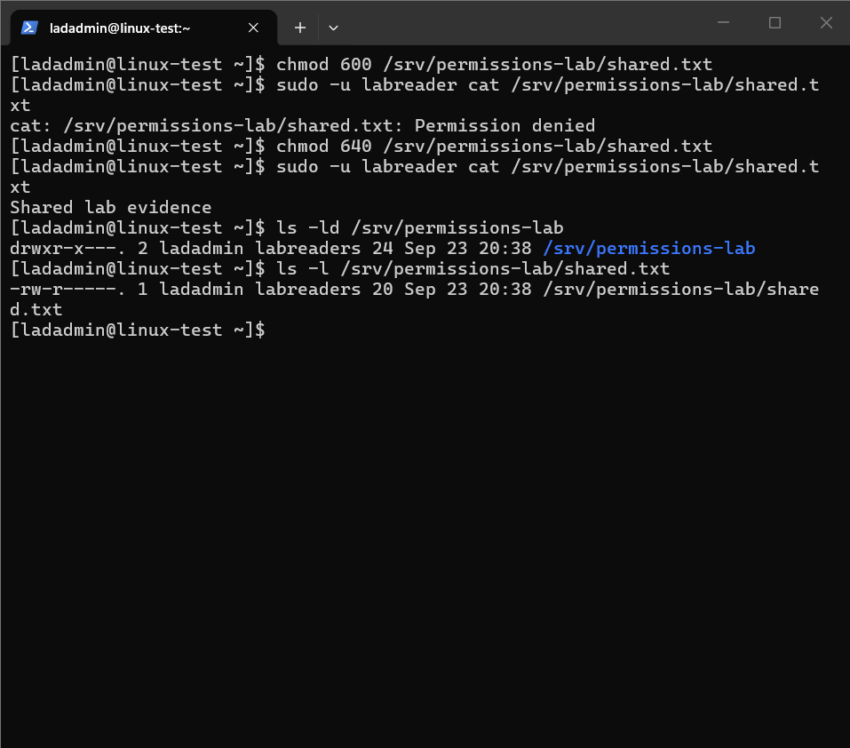

# Part 2 — Linux File Ownership and Permissions

[Back to the project overview](../README.md) · [Part 1 — Remote Administration](../01-remote-administration/README.md)

## Objective and outcome

In this RHEL 9.8 Hyper-V lab, I tested how Linux ownership and permission bits affect real operations. I changed file and directory modes, observed expected access denials, restored access, and tested group-based access using a dedicated unprivileged account.

The exercises demonstrated owner read/write controls, directory listing and traversal, deletion permissions, creation defaults with `umask`, and read-only group access. The final shared directory is owned by `ladadmin:labreaders` with mode `750`; its file has mode `640`.

**Environment:** RHEL 9.8, hostname `linux-test`, administrative user `ladadmin`, running on Hyper-V under Windows 11. Commands were executed in Linux terminals, including a Windows-initiated SSH session. Red Hat registration remained unresolved; these exercises used tools already installed on the VM.

## Permission concepts used

Permissions are evaluated for the owner, group, and others. Numeric mode bits are `r=4`, `w=2`, and `x=1`.

| Permission | Regular file | Directory |
|---|---|---|
| Read (`r`) | Read contents | List entry names |
| Write (`w`) | Modify contents | Modify directory entries, normally requiring traversal too |
| Execute (`x`) | Execute a program | Traverse/search the directory |

Parent-directory access also matters. Mode bits are not the only possible access controls: ACLs, SELinux, special directory bits, and other filesystem properties can affect access. This milestone focuses on ordinary owner/group/other permissions in the tested environment.

## 1. Inspect identity and existing evidence permissions

```bash
whoami
id
ls -ld ~/lab-evidence
ls -l ~/lab-evidence/ssh-login-baseline.txt
```

**Observed:** `ladadmin` had UID 1000, primary group `ladadmin`, and supplementary membership in `wheel`. The evidence directory was mode `755`; the log file was `644`. Both belonged to `ladadmin:ladadmin`.

The `-d` option inspects the directory itself rather than listing its contents. The trailing dot after the permission string in these screenshots indicates security-context information; it is not an extra permission bit.



## 2. Restrict a separate practice file

I kept the Part 1 evidence unchanged and created a separate exercise file:

```bash
mkdir -p ~/permissions-lab
printf 'practice file for Linux permissions.\n' > ~/permissions-lab/practice.txt
ls -l ~/permissions-lab/practice.txt
chmod 600 ~/permissions-lab/practice.txt
ls -l ~/permissions-lab/practice.txt
cat ~/permissions-lab/practice.txt
```

**Observed:** The mode changed from `644` (`rw-r--r--`) to `600` (`rw-------`). The owner could still read the file. No sudo was required to change permissions on my own file.



## 3. Deny and restore owner write access

```bash
chmod 400 ~/permissions-lab/practice.txt
cat ~/permissions-lab/practice.txt
printf 'Write test\n' >> ~/permissions-lab/practice.txt
chmod u+w ~/permissions-lab/practice.txt
printf 'Write test\n' >> ~/permissions-lab/practice.txt
cat ~/permissions-lab/practice.txt
ls -l ~/permissions-lab/practice.txt
```

**Observed:** At mode `400`, reading succeeded but appending returned `Permission denied`. The symbolic change `u+w` restored owner write permission. The second append succeeded, adding `Write test` once, and the final mode was `600`.

**Lesson:** Ownership permits changing the mode, but does not automatically grant write access when that permission is absent. `>>` appends; `>` replaces file contents.



## 4. Test directory read without traversal

```bash
mkdir -p ~/permissions-lab/directory-test
printf 'Directory access test\n' > ~/permissions-lab/directory-test/note.txt
chmod 400 ~/permissions-lab/directory-test
ls ~/permissions-lab/directory-test
cat ~/permissions-lab/directory-test/note.txt
chmod 700 ~/permissions-lab/directory-test
cat ~/permissions-lab/directory-test/note.txt
```

**Observed:** With directory mode `400`, `ls` displayed `note.txt` but also reported an access error while inspecting the entry. Reading the file with `cat` failed. After restoring directory mode `700`, reading succeeded.

Listing entry names and accessing the entries are different operations. The additional inspection attempted by this `ls` invocation could be caused by options such as color output; the alias or options were not independently checked.



## 5. Test traversal without directory listing

```bash
chmod 100 ~/permissions-lab/directory-test
ls ~/permissions-lab/directory-test
cat ~/permissions-lab/directory-test/note.txt
chmod 700 ~/permissions-lab/directory-test
ls -l ~/permissions-lab/directory-test/note.txt
```

**Observed:** Listing was denied at mode `100`, but reading the known filename succeeded. The file itself had mode `644`. I restored the directory to `700` afterward.

**Lesson:** Directory execute permission allows traversal to a known entry, subject to that entry's permissions. Directory read permission allows discovering names.



## 6. Test deletion of a read-only file

This exercise used only a new disposable file:

```bash
printf 'Disposable test file\n' > ~/permissions-lab/directory-test/delete-me.txt
chmod 400 ~/permissions-lab/directory-test/delete-me.txt
chmod 500 ~/permissions-lab/directory-test
rm -f ~/permissions-lab/directory-test/delete-me.txt
chmod 700 ~/permissions-lab/directory-test
rm -f ~/permissions-lab/directory-test/delete-me.txt
ls ~/permissions-lab/directory-test
```

**Observed:** Deletion failed when the parent directory lacked write permission. It succeeded after the directory was restored to `700`, despite the file remaining read-only. `note.txt` remained present.

**Lesson:** Deletion removes a directory entry. Under the conditions tested, directory write and traversal permissions controlled the operation. `rm -f` suppressed prompts; it did not bypass permissions.



## 7. Set creation defaults with a temporary umask

```bash
umask
(
umask 077
touch ~/permissions-lab/private-file.txt
mkdir ~/permissions-lab/private-directory
ls -l ~/permissions-lab/private-file.txt
ls -ld ~/permissions-lab/private-directory
)
umask
```

**Observed:** The original shell mask was `0022`. Inside the subshell, `077` produced a new file with mode `600` and a new directory with mode `700`. The parent shell still reported `0022` afterward.

**Lesson:** `umask` removes bits from requested creation permissions; it does not change existing files. The parentheses limited the setting change to the subshell. These results concern newly created paths; `touch` does not reset permissions on a file that already exists.



## 8. Change a file's group ownership

```bash
printf 'Group ownership practice\n' > ~/permissions-lab/group-test.txt
chgrp wheel ~/permissions-lab/group-test.txt
chmod 640 ~/permissions-lab/group-test.txt
ls -l ~/permissions-lab/group-test.txt
```

**Observed:** Ownership was `ladadmin:wheel`, with mode `640`. As the owner and a member of the target group, I could make the group change without sudo.

This was a file-ownership exercise. It did not change any user's membership or grant sudo access. The next exercise used a dedicated group instead of the administrative `wheel` group.



## 9. Test with a dedicated unprivileged account

I created a lab group and a test user with no home directory created and a non-interactive login shell:

```bash
sudo groupadd labreaders
sudo useradd -M -s /sbin/nologin -G labreaders labreader
id labreader
```

I placed the shared test outside my home directory so restrictions on my home would not obscure the intended group-permission test:

```bash
sudo install -d -o ladadmin -g labreaders -m 750 /srv/permissions-lab
printf 'Shared lab evidence\n' > /srv/permissions-lab/shared.txt
sudo chgrp labreaders /srv/permissions-lab/shared.txt
chmod 640 /srv/permissions-lab/shared.txt
```

Then I verified the effective test identity, read the file, and attempted an append:

```bash
sudo -u labreader id
sudo -u labreader cat /srv/permissions-lab/shared.txt
sudo -u labreader sh -c 'printf "Unauthorized write\n" >> /srv/permissions-lab/shared.txt'
```

**Observed:** `labreader` had UID 1001, primary group `labreader`, and supplementary membership in `labreaders`. Reading succeeded; writing returned `Permission denied`.

**Lesson:** `sudo -u labreader` runs the selected command as the test account. The `sh -c` places the redirection inside that account's shell, so the write is genuinely attempted as `labreader`. The `nologin` shell prevents ordinary interactive shell login; it does not prevent an administrator from running a specific command as the account.



## 10. Remove and restore group read permission

```bash
chmod 600 /srv/permissions-lab/shared.txt
sudo -u labreader cat /srv/permissions-lab/shared.txt
chmod 640 /srv/permissions-lab/shared.txt
sudo -u labreader cat /srv/permissions-lab/shared.txt
ls -ld /srv/permissions-lab
ls -l /srv/permissions-lab/shared.txt
```

**Observed:** At `600`, the test user could not read the file. Restoring `640` restored read access. The final listing confirmed the directory was `750` and the file was `640`, both owned by `ladadmin:labreaders`.



## Results summary

| Scenario | Restricted state | Restored or alternate state |
|---|---|---|
| Owner writes to a file | File `400`: denied | File `600`: allowed |
| Read a known file through a directory | Directory `400`: denied | Directory `700`: allowed |
| Discover names versus traverse | Directory `100`: listing denied | Known readable file accessible |
| Delete a disposable read-only file | Parent `500`: denied | Parent `700`: allowed |
| Create private items | Subshell `umask 077` | File `600`, directory `700`; parent mask unchanged |
| Group member reads shared file | File `600`: denied | File `640`: allowed |
| Group member writes shared file | File `640`: denied | Left read-only for group |

## Final lab state and boundaries

- The original Part 1 log evidence was not modified by these exercises.
- Practice files remain in `/home/ladadmin/permissions-lab`.
- The disposable `delete-me.txt` was removed; `note.txt` remained.
- The exercise directory `directory-test` was restored to `700`.
- The parent shell's observed umask remained `0022`.
- The `labreader` account and `labreaders` group remain for future lab exercises.
- `/srv/permissions-lab` is `750`, and `shared.txt` is `640`, owned by `ladadmin:labreaders`.
- This milestone did not test ACLs, sticky/setgid directories, SELinux policy changes, or access by a separate nonmember account. It does not claim STIG compliance or production hardening.

## Evidence

The ten screenshots are original captures from the exercises, included without editing. They document actual commands and results, including expected denials. This write-up records a completed personal lab, not a script intended to be rerun blindly: commands such as `>` overwrite files, and account-creation commands assume unused names.
