# Part 3 — Security Patching and Change Control

[Project overview](../README.md) · [Part 2 — File Permissions](../02-file-permissions/README.md)

## Objective and result

I applied security-related updates to my RHEL 9.8 Hyper-V VM, `linux-test`, using a documented lab change process: assess, capture a baseline, resolve an existing service failure, create a recovery point, install, reboot, validate, and preserve evidence.

**Result:** DNF transaction 2 installed 5 packages and upgraded 221, returning `Success`. After reboot, the VM ran kernel `5.14.0-687.50.1.el9_8.x86_64`. SSH access worked, SELinux remained enforcing, SSH and firewalld were active, and no systemd units were failed. A refreshed query reported no remaining applicable security advisory rows, and `dnf check` returned 0.

This is a personal lab change, not an actual government Change Control Board approval. The recovery checkpoint was created but rollback was not exercised. Absence of pending repository security advisories is not proof that the machine has no vulnerabilities.

## Change summary

| Field | Recorded value |
|---|---|
| Change ID | LAB-003 |
| Target | `linux-test`, RHEL 9.8 on Hyper-V |
| Administrator | `ladadmin` |
| Date | September 23, 2026; timestamps in EDT |
| Scope | Security-related package upgrades and dependencies |
| Preview | 5 installs, 221 upgrades, 452 MB download |
| Expected impact | Temporary SSH interruption during reboot; networking packages also updated |
| Recovery point | `Before-Part3-Security-Patching` |
| Transaction | ID 2; 22:11:43–22:15:11 EDT; 208 seconds |
| Closure recorded | 22:28:35 EDT |

The original [change record](logs/change-record.txt) preserves the initial pending status followed by the completion entry. The last entry is the final status.

## 1. Confirm update access and capture the baseline

The earlier subscription-registration blocker was resolved through the graphical registration flow. Subscription identity and repository checks succeeded. The cause of the earlier account-registration failures was not established.

```bash
sudo subscription-manager identity
sudo dnf repolist
sudo dnf check-update --refresh
sudo dnf updateinfo list updates security
```

BaseOS and AppStream were enabled and accessible. The subscription-identity screenshot is omitted from this public write-up because it contains account identifiers.

I created an evidence directory and captured the initial health state:

```bash
mkdir -p ~/lab-evidence/part3
{
date --iso-8601=seconds
hostname
cat /etc/redhat-release
uname -r
df -h / /boot
systemctl --failed --no-pager
getenforce
systemctl is-active sshd firewalld
} | tee ~/lab-evidence/part3/pre-patch-baseline.txt
rpm -qa | sort > ~/lab-evidence/part3/packages-before.txt
sudo dnf updateinfo list updates security | tee ~/lab-evidence/part3/security-updates-before.txt
```

**Observed:** The running kernel was `5.14.0-687.5.3.el9_8.x86_64`; `/` had 32 GB available and `/boot` had 527 MB. SELinux was enforcing and SSH/firewalld were active. One Insights results service was failed, which required investigation before establishing the final pre-change baseline.

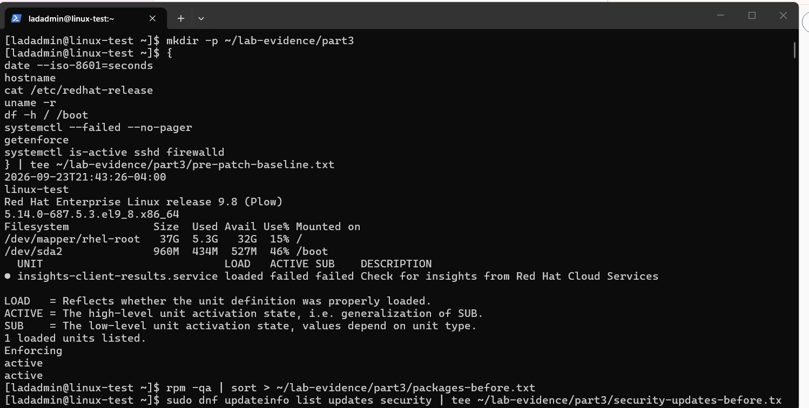

Evidence: [initial baseline](logs/pre-patch-baseline.txt), [installed packages before](logs/packages-before.txt), [security advisories before](logs/security-updates-before.txt).

## 2. Preview the transaction without installing

```bash
sudo dnf upgrade --security --assumeno | tee ~/lab-evidence/part3/security-update-preview.txt
```

The preview resolved dependencies and proposed 5 new packages, 221 upgrades, and a 452 MB download, including a new kernel. `--assumeno` declined the transaction; `Operation aborted` was expected at this stage.

`--security` selects security-related updates and necessary dependencies. Selected package versions can include additional fixes. Advisory rows are not a count of distinct vulnerabilities.

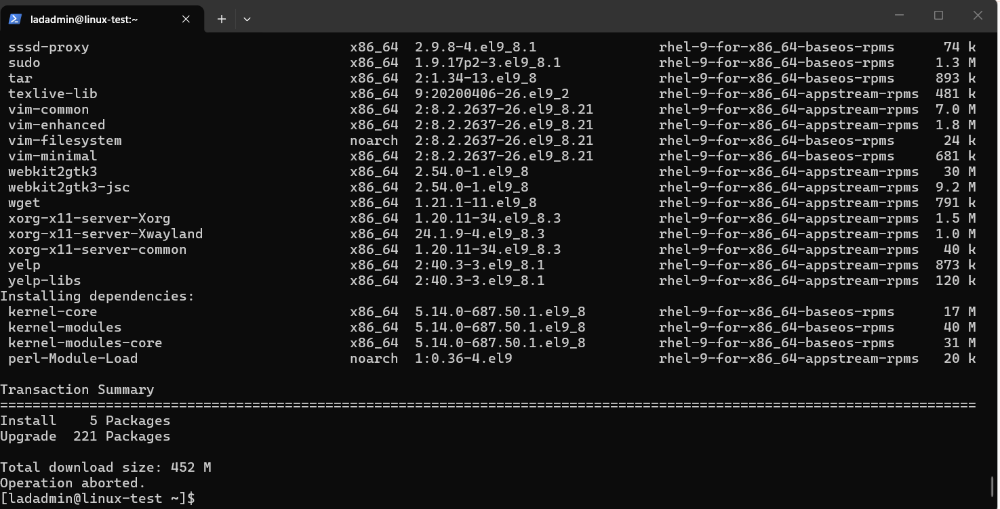

Evidence: [full preview](logs/security-update-preview.txt).

## 3. Investigate and recover the pre-existing Insights failure

```bash
sudo systemctl status insights-client-results.service --no-pager --full 2>&1 | tee ~/lab-evidence/part3/insights-status-before.txt
sudo journalctl -u insights-client-results.service -b --no-pager -n 60 2>&1 | tee ~/lab-evidence/part3/insights-log-before.txt
sudo insights-client --status 2>&1 | tee ~/lab-evidence/part3/insights-registration-status.txt
```

The earlier results check could not find a host with a matching machine ID. The subsequent status query confirmed registration locally and through the Insights API. I reran the service:

```bash
sudo systemctl start insights-client-results.service
sudo systemctl status insights-client-results.service --no-pager --full 2>&1 | tee ~/lab-evidence/part3/insights-status-recheck.txt
systemctl --failed --no-pager
systemctl --failed --no-pager | tee ~/lab-evidence/part3/failed-units-before-patch.txt
```

**Observed:** The check exited with `status=0/SUCCESS`; zero units remained failed. Its final `inactive (dead)` state was normal for a completed check. Registration timing was a possible explanation for the original failure, not a confirmed root cause. No machine ID change or RHEL re-registration was needed.

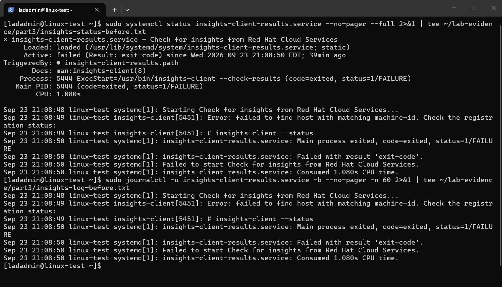

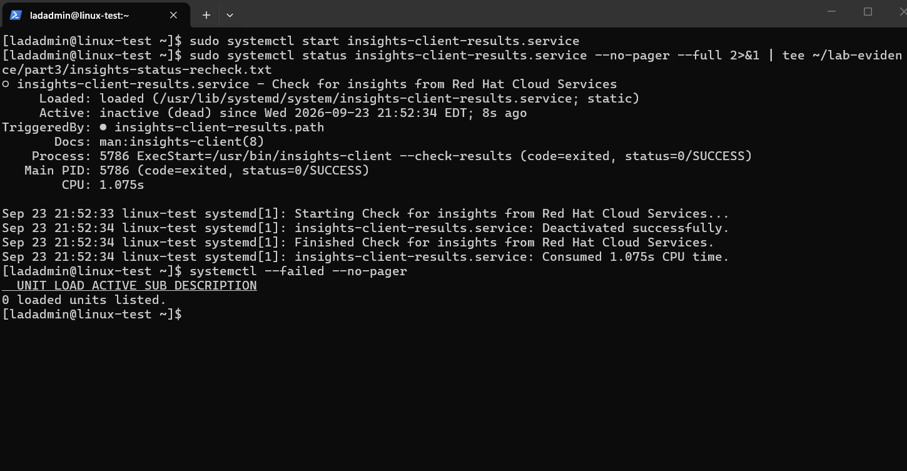

Evidence: [original status](logs/insights-status-before.txt), [original journal](logs/insights-log-before.txt), [registration status](logs/insights-registration-status.txt), [recheck](logs/insights-status-recheck.txt), [clean pre-patch service state](logs/failed-units-before-patch.txt).

## 4. Establish a recovery point and document the change

The preparation procedure included copying the evidence to Windows and shutting down Linux cleanly. In Hyper-V Manager I created and named `Before-Part3-Security-Patching` while `linux-test` was off. The screenshot verifies the named checkpoint and powered-off VM; it does not verify a restore operation.

```bash
sudo poweroff
```

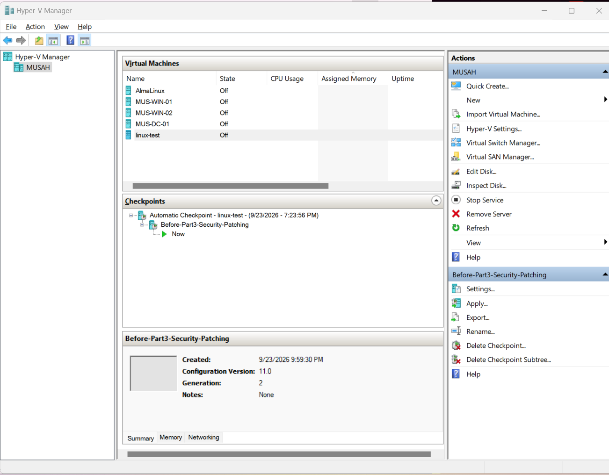

A checkpoint is a local rollback point, not an independent backup. Applying it would discard subsequent VM changes. The change plan specified preserving failure evidence outside the VM before any rollback. Rollback would be considered for boot failure or loss of essential access that could not be resolved during the lab maintenance session.

After startup, I wrote [LAB-003](logs/change-record.txt) with the target, scope, expected outage, recovery point, rollback trigger, and validation criteria. This was a self-managed lab change record; no independent approval is claimed.

## 5. Install the reviewed updates

```bash
sudo dnf upgrade --security 2>&1 | tee ~/lab-evidence/part3/security-update-install.txt
```

The installation finished with `Complete!`. The actual session shown was Windows-to-Linux SSH, although console execution had been recommended to avoid dependence on network continuity. The session survived this update; that does not guarantee SSH will survive other networking updates.

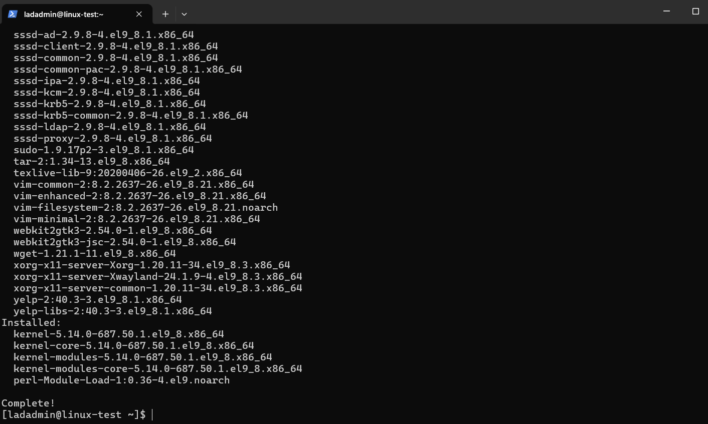

I checked the recorded transaction rather than relying only on the output pipeline:

```bash
sudo dnf history info last | tee ~/lab-evidence/part3/patch-transaction.txt
```

**Observed:** Transaction 2 reported `Return-Code: Success`. The recorded package actions contain 5 installs and 221 upgrades. A scriptlet warning said the `foomaticrip-upgrade.service` definition changed on disk and recommended a systemd daemon reload. This warning did not change the successful transaction result.

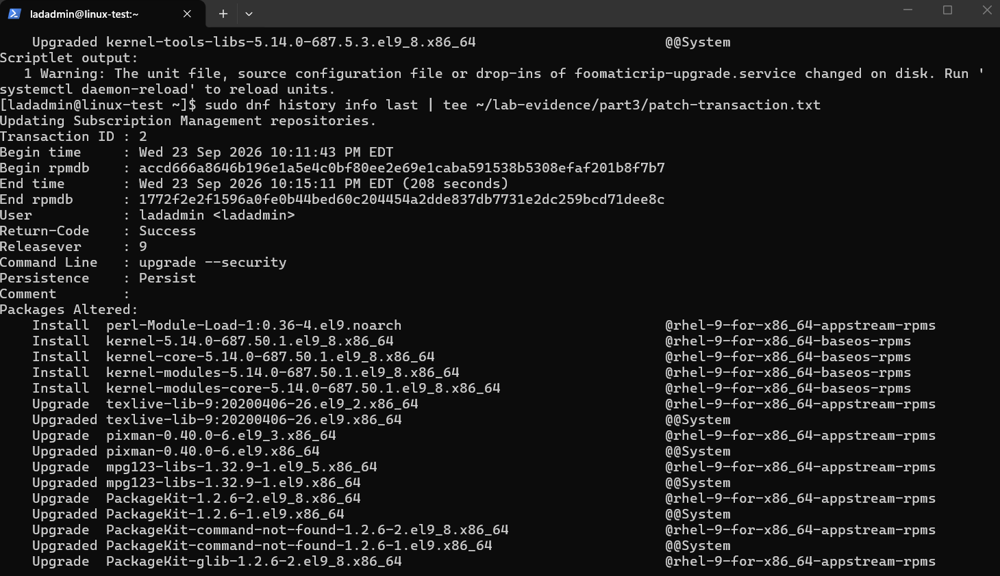

Evidence: [installation output](logs/security-update-install.txt), [transaction details](logs/patch-transaction.txt).

## 6. Reboot and validate the running system

The next procedure was to reload unit definitions and reboot:

```bash
sudo systemctl daemon-reload
sudo reboot
```

The individual commands were not captured in a dedicated screenshot. The subsequent evidence verifies that the new kernel was running and that a new SSH connection from Windows succeeded:

```powershell
ssh ladadmin@172.28.160.117
```

In Linux, I saved the post-change checks:

```bash
{
date --iso-8601=seconds
hostname
uname -r
systemctl --failed --no-pager
getenforce
systemctl is-active sshd firewalld
ip -brief address
df -h / /boot
} | tee ~/lab-evidence/part3/post-patch-baseline.txt
```

| Check | Post-change result |
|---|---|
| Running kernel | `5.14.0-687.50.1.el9_8.x86_64` |
| Failed units | 0 |
| SELinux | Enforcing |
| SSH and firewalld | Active |
| Remote login from Windows | Successful |
| Network | `eth0` UP, private lab address `172.28.160.117/20` |
| Available space | `/`: 31 GB; `/boot`: 410 MB |

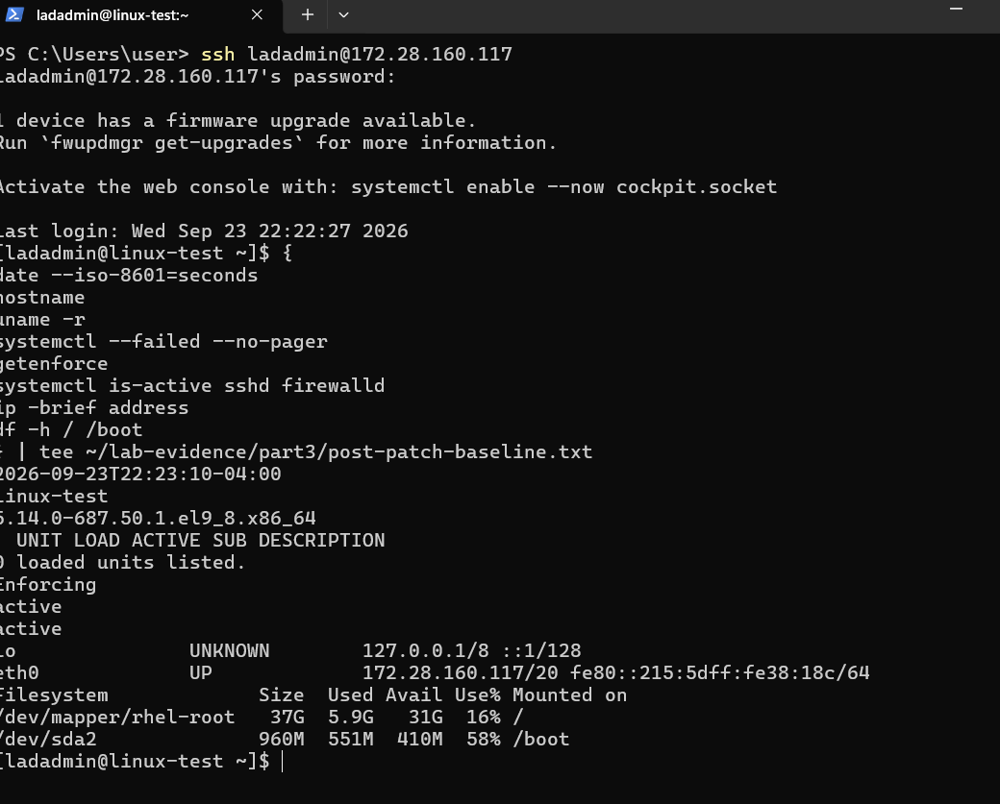

Evidence: [post-patch baseline](logs/post-patch-baseline.txt).

## 7. Check remaining security updates and package dependencies

```bash
sudo dnf --refresh updateinfo list updates security 2>&1 | tee ~/lab-evidence/part3/security-updates-after.txt
sudo dnf check
echo $?
rpm -qa | sort > ~/lab-evidence/part3/packages-after.txt
```

**Observed:** After refreshing repository metadata, the security query displayed no advisory/package rows. `dnf check` reported no dependency problems and its immediately captured exit code was `0`. The post-patch package inventory was saved.

The exit code shown belongs to `dnf check`, not the earlier piped security query. A pipeline ending in `tee` does not by default preserve the first command's exit status. For the installation, the saved DNF history supplied an explicit success result.

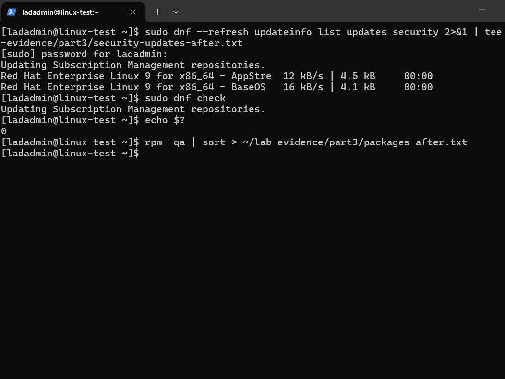

Evidence: [security query after patching](logs/security-updates-after.txt), [installed packages after](logs/packages-after.txt). Dependency-check output and exit status are captured in the screenshot.

## 8. Close the change and preserve evidence outside the VM

I appended the completed validation results to the change record, retained the initial plan, and added a timestamp:

```bash
date --iso-8601=seconds >> ~/lab-evidence/part3/change-record.txt
```

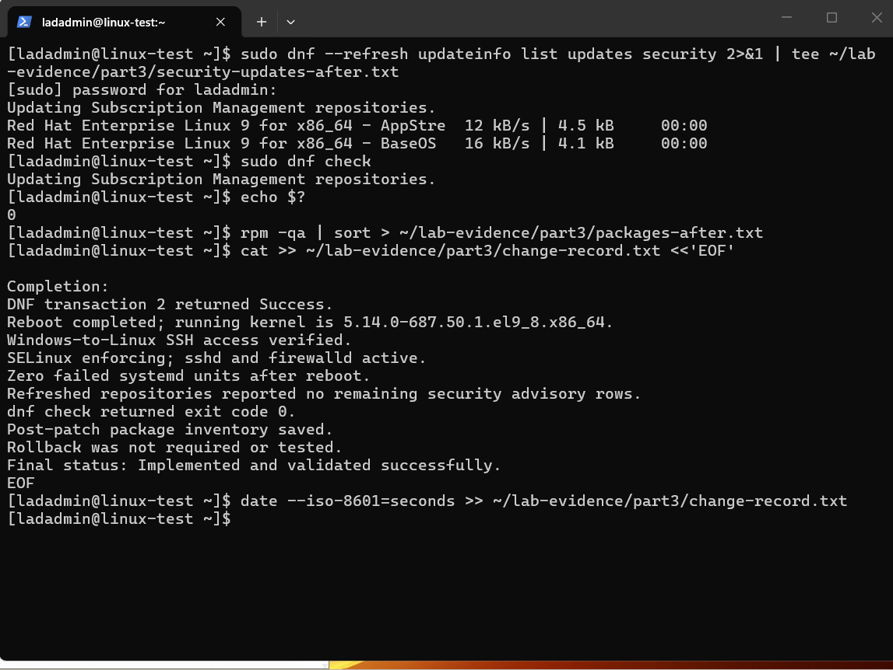

From Windows PowerShell, I copied the evidence directory and listed the destination:

```powershell
scp -r ladadmin@172.28.160.117:/home/ladadmin/lab-evidence/part3 "$HOME\Downloads\part3-completed-evidence"
Get-ChildItem "$HOME\Downloads\part3-completed-evidence"
```

The transfer reported completion for all 15 text files. The Windows copies are included in this milestone's `logs/` directory. Unlike the Part 1 single-file exercise, a separate cross-host SHA-256 comparison was not performed for this batch.

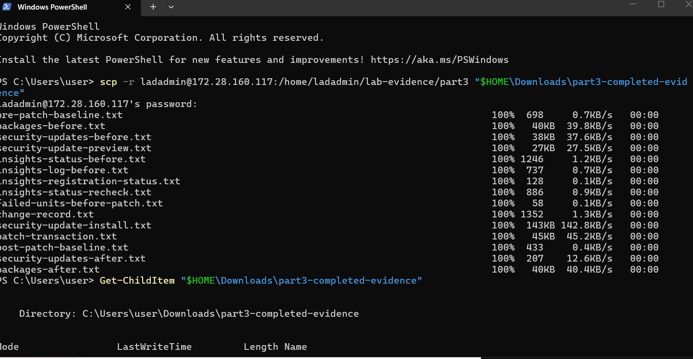

## Lessons and scope

- Capture a baseline before changes so existing failures are not attributed to patching.
- Registration success and an Insights results-check failure can coexist; inspect the specific component before changing account or machine identity.
- Preview package actions and plan for a reboot when installing a kernel.
- An installed kernel is not necessarily the running kernel; verify with `uname -r` after reboot.
- Validate remote access, service state, security enforcement, dependencies, and remaining advisories before closing a change.
- A checkpoint's existence does not demonstrate recovery capability; restore testing remains future work.

No application workload was deployed for application-level testing. No Nessus scan, STIG assessment, or formal government authorization was performed in this milestone. The results support successful completion of this defined lab patching change, not a claim of complete system security.

## Evidence notes

This folder contains 11 original screenshots and 15 text evidence files copied from the Windows transfer destination. Images were not edited. The checkpoint screenshot includes other local VM names; the selected screenshots omit the subscription identity output. Private lab addresses and the lab account name remain visible to explain the tests.

The included change record is a chronological artifact: its initial pending status is superseded by the appended successful completion. The checkpoint was retained at closure, and no rollback was required or tested.
